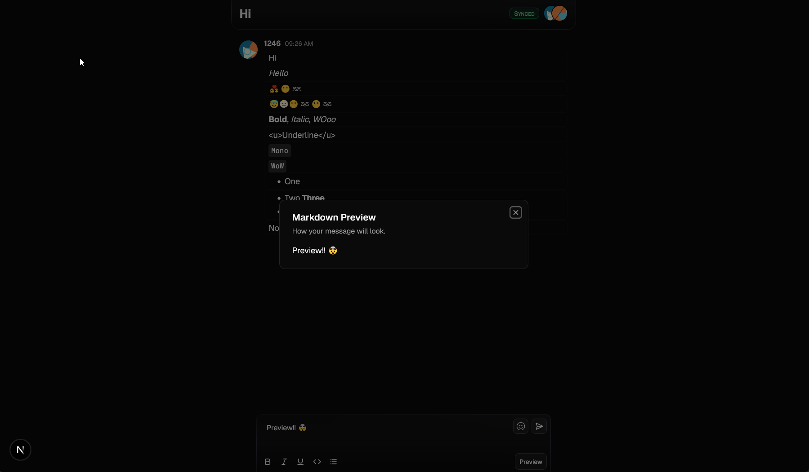
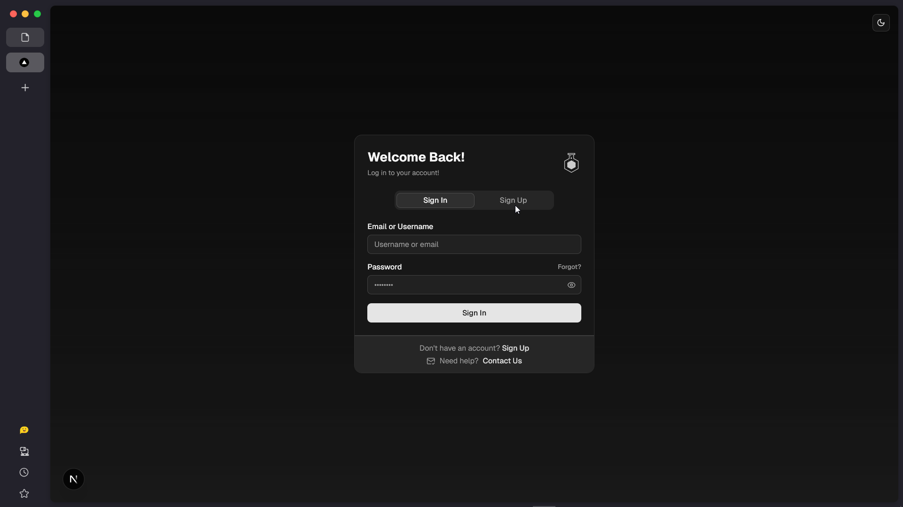
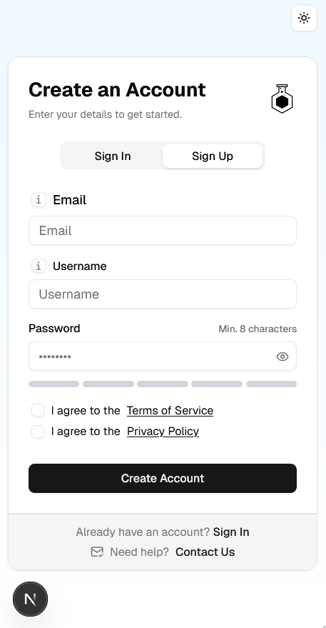
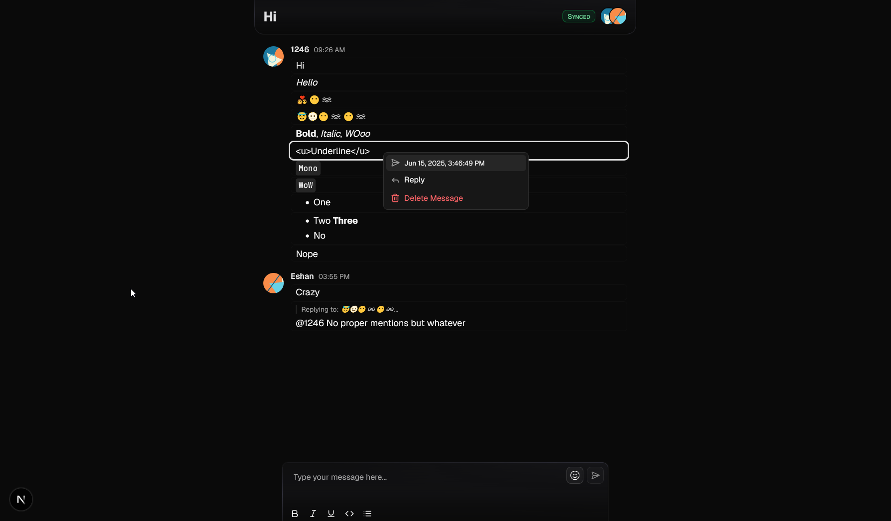

<div align="center">
  <br />
  <div>
    
    
    
    
    
    
     

  </div>
  <h3 align="center"> Real-time chat with admin features </h3>

  <div align="center">
    Attempt at making an event chat (MD support) with realtime features via Zero and admin features (Timeout, slow mode, blocked words, ...). Currently still a work in progress
  </div>
</div>

## 🍁 Overview

This project is an attempt at a real-time chat application designed for events, communities, and live discussions. It leverages the power of [Rocicorp Zero](https://zero.rocicorp.dev/) for seamless real-time data synchronization and optimistic UI updates, ensuring a fluid user experience. The application provides a rich set of features for users, including Markdown support and message replies, coupled with robust admin capabilities for event management and chat moderation (EX: Slow mode, user timeouts, blocked words). Still WIP

### 💻 Technolgoies

[](https://react.dev/ "React JS") [](https://nextjs.org/ "Next JS")  [](https://tailwindcss.com/ "Tailwind CSS") [](https://vercel.app/ "Vercel")

- **Language**: Typescript
- **Backend**: [Next.js 15](https://nextjs.org/) + [NeonDB](https://neon.com/) with Drizzle. [Upstash](https://upstash.com/)
- **Frontend**: [Next.js 15](https://nextjs.org/) + UI Components via [`shadcn/ui`](https://ui.shadcn.com/) + Tailwind
- **Others**: [Zero (Rocicorp)](https://zero.rocicorp.dev/), `drizzle-zero`, Auth.js, `pg`, `zod`, `react-hook-form`, `remark`, and more

## 🚀 Features

*   💬 **Real-Time Messaging:** Experience instant message delivery and updates powered by Rocicorp Zero's optimistic UI. Along with markdown (limited) support and emoji picker (`frimmouse`)
*   📱 **Responsive Design:** Enjoy a seamless chat experience on desktop, tablet, or mobile devices.
*   🎨 **Light/Dark Mode:** Switch between light and dark themes for your viewing comfort.
*   🔐 **Role-Based Access Control:** Differentiated experience for regular users and administrators.
*   🗓️ **Event Management:** Admins can create, activate, and manage chat events (WIP).
*   ⏳ **Slow Mode:** Admins can enable/configure slow mode for the chat, limiting how often users can send messages (WIP).
*   🚫 **Blocked Words Filter:** Implement a system to filter or flag messages containing predefined blocked words (Partial)
*   ⏲️ **User Timeout/Mute:** Admins can temporarily mute or timeout users
*   📈 **Rate Limiting:** Global and user based, sliding window and token bucket based rate limting for messages via upstash

## 🤝 Usage

1. Chat
   1. In the application login/signup
   2. Then you can join the active events (Currently, it just pushes to `/chat`)
   3. Here you'll see a familiar chat interface with intuitive buttons
   4. Right-click (or long-press on mobile) on a message to reply or view its timestamp.
2. Admin
   1. If your account has admin privileges you can access admin dashboard and do suer and event management (WIP)
   2. Otherwise in the chat interface you can delete message via the context menu, see blocked words, timeout or mute users and much more (Partial)
   3. You have more functionality in chats as well

## ⚙️ Setup

- Get Node (v22+ used) and `pnpm` (v10.x).
- Setup upstash and neon
- Clone the project and take `.env.example` and rename to `.env` (Zero didn't pick up `.env.local`) and set it up
- Run the following commands
```
pnpm db:generate
pnpm zero:generate-schema
pnpm dev
# If you want to build then instead of zero: just do pnpm build -> pnpm start
```

## 📱 Screenshots

<div align="center">






(Rest are still WIP)

</div>

## 📄 Additional Notes

- See LICENSE (GPLv3)
- Feel free to raise issues if you notice anything wrong

*   [ ] Full implementation of Slow Mode controls per user and global.
*   [ ] User timeout/mute functionality for admins.
*   [ ] Comprehensive blocked words filter.
*   [ ] Better markdown implementation and reply system
*   [ ] User presence indicators.
*   [ ] Sound notifications for new messages.
*   [ ] More detailed admin analytics.
*   [ ] Customizable user profiles.
*   [ ] Support for multiple chat rooms/events simultaneously and event details/categories.
*   [ ] Polls or Q&A features within chat.
*   [ ] Image link shows as actual image
